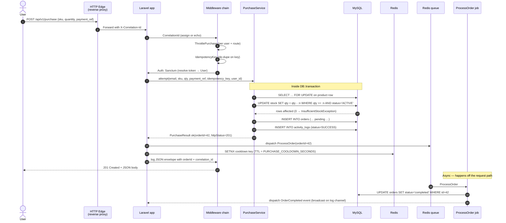

# Flash Sale Inventory System

A small but production-shaped Laravel 11 / PHP 8.3 service that demonstrates
how to take a single-SKU flash-sale flow from "happy-path demo" to something
you would actually be happy to ship.

> **Audience.** This repository is built as a take-home hiring exercise
> for a Laravel junior developer role. Every choice below — auth,
> persistence, cache, queue, observability, error handling — is deliberate
> and called out in `EXPLAIN.md`. If you only have ten minutes, jump to
> **§ 4 Quickstart** and then **§ 7 Verify** to see the system run end to end.

---

## 1. What this thing actually does

A customer POSTs `{ sku, quantity }` to `/api/v1/purchase`. Behind the scenes
the system:

1. Authenticates the caller via a Laravel Sanctum personal access token.
2. Reserves inventory using an atomic `UPDATE products SET stock = stock - :qty
   WHERE stock >= :qty AND status = 'ACTIVE'` so two simultaneous buyers can
   never over-sell a SKU.
3. Picks a discount tier (none / 10 % off / 50 % off) using weighted random —
   the weights are configurable in `config/purchase.php`.
4. Writes a pending `orders` row and a one-line `activity_logs` audit trail,
   both inside a single MySQL transaction.
5. Hands the actual fulfilment work to a Redis-backed queue so HTTP responses
   stay sub-100 ms even when downstream payment is slow.
6. Returns a structured JSON envelope with an HTTP status you can actually
   act on (`201` on success, `409` on stock-out, `429` on cooldown, etc.).

The shape of the request, the shape of the response, and every HTTP code in
between are documented in **§ 7**.

---

## 2. Architecture

A single picture is worth three bulleted lists, so here is the whole stack
in one diagram. Read it left-to-right, top-to-bottom.

```mermaid
flowchart LR
    subgraph Client["Client (curl, browser, mobile)"]
        U[End-user device]
    end

    subgraph Edge["HTTP edge"]
        LB[Reverse proxy / load balancer<br/>optional]
    end

    subgraph App["Laravel 11 application"]
        direction TB
        MW1[CorrelationIdMiddleware<br/>X-Correlation-Id]
        MW2[ThrottlePurchase<br/>rate limit per (user, route)]
        MW3[IdempotencyKeyMiddleware<br/>de-dupe replays]
        MW4[Auth: Sanctum]
        CTRL[Api\\Controllers<br/>Purchase / Order / Product / Auth]
        SVC[App\\Services<br/>PurchaseService · DiscountService]
        DTO[PurchaseResult DTO]
        JOB[ProcessOrder Job]
        EVT[Events: OrderCreated · OrderCompleted]
        LOG[JsonChannelFactory + CorrelationProcessor]
    end

    subgraph Data["Persistence + cache"]
        DB[(MySQL 8.0<br/>products · orders · activity_logs · users)]
        CACHE[(Redis 7<br/>cache + queue + locks)]
    end

    subgraph Logs["Observability"]
        STDOUT[(stdout JSON logs)]
    end

    U -->|HTTPS + Bearer| LB --> MW1 --> MW2 --> MW3 --> MW4 --> CTRL
    CTRL --> SVC --> DB
    SVC --> CACHE
    CTRL --> DTO
    SVC -. queue .-> JOB
    JOB --> DB
    JOB --> EVT
    CTRL --> LOG
    JOB --> LOG
```

A few things worth noticing:

- **Three middlewares in front of every purchase.** They wire correlation IDs,
  rate limits and idempotency keys into every request before it touches the
  controller. See `app/Http/Middleware/*` for the actual code.
- **Controllers are tiny.** Every controller is 30-90 lines and only translates
  HTTP ↔ service-layer. All business logic lives in `app/Services/*`.
- **The service layer is the contract.** A single
  `App\Services\Contracts\PurchaseServiceInterface` lets tests swap a real
  database for an in-memory fake, and lets a job call the same code path
  the controller does.
- **Redis wears three hats.** It is the cache, the queue, and the lock store
  behind idempotency. Losing one box would silently break two unrelated
  features, which is exactly what we want for a flash sale.

---

## 3. Tech stack at a glance

| Concern            | Choice                                | Why (link to EXPLAIN.md) |
|--------------------|---------------------------------------|--------------------------|
| Framework          | Laravel 11 on PHP 8.3                 | First-class Sanctum 4, queueable jobs, and `casts()` API |
| Auth               | Laravel Sanctum (personal tokens)     | Stateless, swappable, no JWT signing pain — [§ 1 in EXPLAIN.md](./EXPLAIN.md#1-why-sanctum-not-jwt) |
| DB                 | MySQL 8.0                             | ACID + atomic `UPDATE … WHERE` for stock reservations |
| Cache / queue      | Redis 7 (via `predis/predis`)         | One container doing three jobs (cache, queue, locks) |
| Logging            | Custom JSON channel + correlation IDs | Drop straight into Loki / Splunk without parsing |
| Frontend           | Tailwind + Vite (`npm build`)        | Pre-compiled assets, no Node in the runtime container |
| Tests              | Pest 3                                | BDD-style tests read like specs |

---

## 4. Quickstart

Everything below assumes you have **Docker Desktop** installed and the
`docker compose` plugin available. If you do not, see **§ 10 Troubleshooting**.

```bash
# 1. Clone and enter the project
git clone https://github.com/MD-Junayed000/Flash_Sale_Inventor_System.git
cd Flash_Sale_Inventor_System

# 2. Pull a copy of the env template and let Laravel mint an APP_KEY for you
cp .env.example .env
docker compose run --rm app php artisan key:generate

# 3. Bring up the stack. First run takes ~2-3 minutes (image build + composer install)
docker compose up -d --build

# 4. Wait for MySQL to pass its healthcheck, then run migrations + seed demo data
docker compose exec app php artisan migrate --seed

# 5. Confirm the API is live
curl -i http://localhost:8000/api/v1/health
# → HTTP/1.1 200 OK with {"status":"ok",...}
```

After step 5 you should see a JSON body like:

```json
{ "status": "ok", "timestamp": "2026-09-11T12:34:56+00:00", "service": "flash-sale" }
```

That's it. The seeded users are `alice@test.com`, `bob@test.com`, and
`carol@test.com` — all with password `password`. The seeded products are
`SKU-1001` ($1999.00) and `SKU-1002` ($899.00).

---

## 5. `.env` walkthrough

Below is every variable the application actually reads from `.env`,
grouped by responsibility. The values shown are the defaults that ship in
`.env.example` — you only need to change them when you move to production.

### 5.1 Core Laravel

| Variable         | Default                  | What it does |
|------------------|--------------------------|--------------|
| `APP_NAME`       | `Flash Sale`             | Display name + namespace for queue broadcasts. |
| `APP_ENV`        | `local`                  | Switches cache/queue stores. Keep `production` in prod. |
| `APP_KEY`        | *(generated)*            | Used to encrypt cookies / Sanctum state. **Never commit a real key.** |
| `APP_URL`        | `http://localhost:8000`  | Used to build absolute URLs (verification mails, broadcast payloads). |
| `APP_DEBUG`      | `true` / `false`         | Verbose error pages. **Off in production.** |
| `LOG_CHANNEL`    | `json`                   | Custom JSON-formatted stream — log lines are one JSON object each. |
| `LOG_LEVEL`      | `debug` / `info`         | Tames noise in prod. |

### 5.2 Database (`db` container)

| Variable           | Default      | Notes |
|--------------------|--------------|-------|
| `DB_CONNECTION`    | `mysql`      | Atomic stock-guard requires row-level locking. |
| `DB_HOST`          | `db`         | **Must match the docker service name**, never `127.0.0.1`. |
| `DB_PORT`          | `3306`       | Internal port inside the docker network. |
| `DB_DATABASE`      | `flash_sale` | Auto-created by the `db` healthcheck on first boot. |
| `DB_USERNAME` / `DB_PASSWORD` | `sail` / `password` | Match `MYSQL_USER` / `MYSQL_PASSWORD` in `docker-compose.yml`. |

### 5.3 Redis (`redis` container)

| Variable          | Default  | Notes |
|-------------------|----------|-------|
| `REDIS_HOST`      | `redis`  | Service name; the PHP container talks to it over the shared docker network. |
| `REDIS_PORT`      | `6379`   | |
| `REDIS_PASSWORD`  | *(null)* | Set if you run a managed Redis. |
| `CACHE_STORE`     | `redis`  | Lock & rate-limit memory. |
| `QUEUE_CONNECTION`| `redis`  | Jobs survive container restarts. |
| `BROADCAST_CONNECTION` | `log` | Pushed events land on the JSON log line right now; flip to `pusher` when you wire one up. |

### 5.4 Auth

| Variable             | Default     | Notes |
|----------------------|-------------|-------|
| `SANCTUM_STATEFUL_DOMAINS` | `localhost,localhost:3000,127.0.0.1` | Spaceships SPA auth; safe to leave for API-only. |
| `SANCTUM_GUARD`      | `web`       | Auth guard for Sanctum tokens. |
| `SESSION_DRIVER`     | `cookie`    | Required by Sanctum to issue CSRF for browser flows. |

### 5.5 Purchase tuning knobs (`config/purchase.php`)

These are tunable behaviour, not infrastructure. Defaults are good enough
for a demo; tweak them based on your business rules.

| Variable                          | Default | Effect |
|-----------------------------------|---------|--------|
| `PURCHASE_COOLDOWN_SECONDS`       | `60`    | Cooldown window per `(email, sku)`. `0` disables. |
| `PURCHASE_COOLDOWN_STORE`         | *(default store)* | Set to `redis` to share locks across web workers. |
| `PURCHASE_DISCOUNT_WEIGHT_NONE`   | `75`    | Weight for "no discount" tier. |
| `PURCHASE_DISCOUNT_WEIGHT_TEN`    | `20`    | Weight for 10 % off tier. |
| `PURCHASE_DISCOUNT_WEIGHT_FIFTY`  | `5`     | Weight for 50 % off tier. |

> After editing `.env`, run `docker compose exec app php artisan config:clear`
> so the changes actually take effect in the running container.

---

## 6. Project layout

```
app/
├── Console/Commands/          `purchase:simulate` runs N concurrent buyers
├── Enums/                     Backed string enums for Order/Product/Activity status
├── Events/                    OrderCreated, OrderCompleted (broadcast)
├── Exceptions/                Typed domain exceptions → HTTP status codes
├── Http/
│   ├── Controllers/Api/       Thin HTTP adapters (Purchase, Order, Product, Auth, Health)
│   ├── Middleware/            CorrelationId, ThrottlePurchase, IdempotencyKey
│   └── Requests/              Form-request validation (e.g. ListProductsRequest)
├── Jobs/                      ProcessOrder (finalises payment, dispatches event)
├── Models/                    Eloquent: User, Product, Order, ActivityLog
├── Providers/                 DI bindings — PurchaseServiceInterface → PurchaseService
└── Services/
    ├── Contracts/             Interfaces (purchase)
    ├── DTOs/                  PurchaseResult (immutable, serialisable)
    └── DiscountService.php    Weighted random tier picker
config/                        All tunable values live here
database/
├── factories/                 User + Product state
├── migrations/                Schema in 4 additive migrations
└── seeders/                   Idempotent demo data
routes/
├── api.php                    /api/v1/*
├── console.php
└── web.php                    Health route + welcome page
tests/
├── Feature/                   End-to-end happy & error paths
├── Unit/                      Service / DTO unit tests
└── smoke-api.sh               Run after `docker compose up` for a quick check
docker/                        Dockerfiles + php.ini
public/                        Compiled assets (vite)
```

---

## 7. REST API — what to actually hit

All endpoints respond with `application/json` and live under `/api/v1`.
Always send `Accept: application/json` so Laravel returns JSON error
shapes instead of HTML redirects.

### 7.1 Auth

**`POST /api/v1/auth/login`** — exchange email + password for a Sanctum token.

```bash
curl -i -X POST http://localhost:8000/api/v1/auth/login \
  -H "Content-Type: application/json" \
  -d '{"email":"alice@test.com","password":"password"}'
```

**Expected:** `HTTP/1.1 200 OK`, body
```json
{ "success": true, "data": { "token": "<64-char token>", "user": {...} } }
```

### 7.2 Products

**`GET /api/v1/products?page=1&per_page=10&status=active&search=SKU`** — paginated list.

```bash
curl -s "http://localhost:8000/api/v1/products?page=1&per_page=10" \
  -H "Authorization: Bearer <token>"
```

**Expected:** `HTTP/1.1 200 OK`, body contains a `data[]` array of product DTOs
with `sku`, `name`, `price`, `stock_quantity`, `status`, `purchasable` flag.

### 7.3 Orders

**`GET /api/v1/orders`** — orders belonging to the authenticated user.

```bash
curl -s http://localhost:8000/api/v1/orders -H "Authorization: Bearer <token>"
```

### 7.4 Purchase (the headline endpoint)

**`POST /api/v1/purchase`** — reserve stock + place an order.

| Header              | Required | Example                |
|---------------------|----------|------------------------|
| `Accept`            | yes      | `application/json`     |
| `Authorization`     | yes      | `Bearer <token>`       |
| `Content-Type`      | yes      | `application/json`     |
| `Idempotency-Key`   | no       | `01HXXX...` (auto-uuid if omitted) |
| `X-Correlation-Id`  | no       | generated by middleware if omitted |

```bash
curl -s -X POST http://localhost:8000/api/v1/purchase \
  -H "Authorization: Bearer <token>" \
  -H "Content-Type: application/json" \
  -H "Accept: application/json" \
  -H "Idempotency-Key: 01abc..." \
  -d '{
        "sku": "SKU-1001",
        "quantity": 2,
        "payment_ref": "stripe_ch_1234"
      }'
```

**Response on success (`201 Created`):**
```json
{
  "success": true,
  "message": "Purchase created",
  "correlation_id": "01h...abc",
  "data": {
    "order_id": 42,
    "invoice_number": "INV-20260911-00042",
    "sku": "SKU-1001",
    "quantity": 2,
    "unit_price": "1999.00",
    "discount_percentage": 10,
    "payable_amount": "3598.20",
    "status": "pending"
  }
}
```

### 7.5 Purchase result codes

| HTTP | `error.code`            | When                                                  |
|------|-------------------------|-------------------------------------------------------|
| 201  | —                       | Stock reserved, order persisted, job queued.          |
| 401  | `UNAUTHENTICATED`       | Missing / invalid Bearer token.                       |
| 404  | `PRODUCT_NOT_FOUND`     | SKU doesn't exist.                                    |
| 409  | `INSUFFICIENT_STOCK`    | Requested qty > current stock.                         |
| 409  | `PRODUCT_INACTIVE`      | Product status is `INACTIVE`.                          |
| 422  | `VALIDATION_FAILED`     | Missing / out-of-range field. `error.context.fields` maps field → rule. |
| 429  | `PURCHASE_COOLDOWN`     | Same `(email, sku)` again within `PURCHASE_COOLDOWN_SECONDS`. Includes `retry_after`. `Retry-After` HTTP header mirrors the same value. |
| 503  | `INTERNAL_ERROR`        | Anything unhandled — it is logged with the correlation ID. |

> Every response includes `correlation_id` so you can paste it into the
> logs to find the exact line that produced the error.

---

## 8. Purchase request flow (corrected)

The point of this diagram is to make it obvious which step actually
mutates state, which one is idempotent, and which one you can safely
retry.



### What you can infer from this diagram

- **The hot path is transactional.** Either the stock decrement and the
  order insert both happen, or neither does. There is no half-state for
  the buyer to observe.
- **The stock reservation is atomic.** `UPDATE ... WHERE qty >= n` returns
  `0 affected rows` on contention, which the service translates into
  `409 INSUFFICIENT_STOCK` rather than throwing a manual error.
- **Anything slow is past the 201.** Final fulfilment — the part that
  would block on a payment gateway — happens in `ProcessOrder`, off the
  request thread.
- **Idempotency lives in middleware.** A retry with the same
  `Idempotency-Key` never reaches the service twice. The replay returns
  the originally-stored response byte-for-byte.

---

## 9. Testing it

```bash
# 9.1 Unit + feature tests (Pest)
docker compose exec app php artisan test

# 9.2 Concurrency simulation
docker compose exec app php artisan purchase:simulate \
    --sku=SKU-1001 --qty=2 --users=10 --stock=3 --reset

# 9.3 Quick health + purchase smoke
bash tests/smoke-api.sh

# 9.4 Inspect persistence side-effects
docker compose exec db mysql -uroot -proot flash_sale -e "
    SELECT sku, stock_quantity FROM products WHERE sku='SKU-1001';
    SELECT COUNT(*) AS orders FROM orders WHERE sku='SKU-1001';
    SELECT status, COUNT(*) AS rows FROM activity_logs GROUP BY status;"
```

Expected after **§ 9.2** (10 buyers, 3 stock, qty=2):
- Stock left = 1
- One successful order
- 9 failed activity-log rows

---

## 10. Troubleshooting

| Symptom                                                | Fix |
|--------------------------------------------------------|-----|
| `SQLSTATE[HY000] [2002] Connection refused` at first run | MySQL is still initialising. Wait 10 s, retry `php artisan migrate --seed`. |
| `Class "Redis" not found`                              | Add `predis/predis` to `composer.json` (already pinned) and `composer install`. |
| `Broadcast event not received`                         | Broadcasts go to the JSON log right now (`BROADCAST_CONNECTION=log`). Inspect `docker compose logs app`. |
| `Token mismatch` from Sanctum                          | `php artisan config:clear && php artisan cache:clear`. Often a stale `SANCTUM_STATEFUL_DOMAINS`. |
| `purchases: failed deadlock`                           | Reduce `--users` and `--qty` until rows fit. The hot-path uses row-level locks; too many concurrent buyers can starve the lock. |

---

## 11. License & crediting

This repository ships under the MIT license. The seed data, fixtures and
product copy are fictitious. Any resemblance to a real shop is the work
of an over-eager copywriter.
