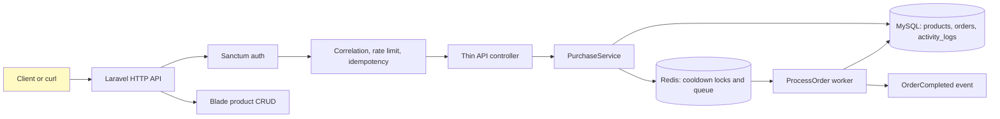
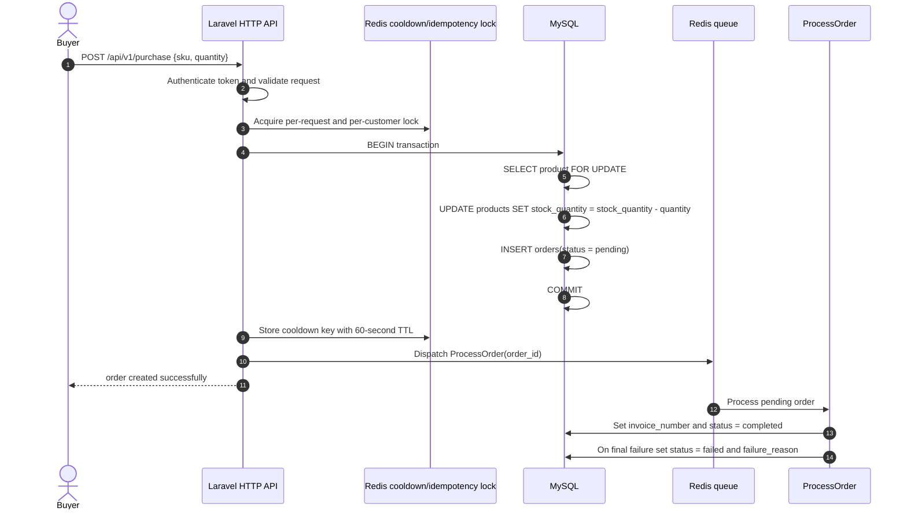

# Flash Sale Inventory System

A Laravel application for handling flash-sale purchases safely when many customers request the same limited-stock product.

It demonstrates:

- Product CRUD with Blade
- Sanctum API authentication
- Transactional stock reservation with MySQL row locking
- Redis-backed queues and cache
- Idempotent purchase requests
- Per-customer SKU cooldowns
- Activity logging for successful and failed attempts
- Asynchronous invoice generation
- Configurable mystery discounts

## 1. Requirements

Install:

- Docker Desktop with Docker Compose
- Git
- Bash, or another shell that can run `tests/smoke-api.sh`

No local PHP, Composer, MySQL, or Redis installation is required.

## 2. Start the project

```bash
git clone https://github.com/MD-Junayed000/Flash_Sale_Inventor_System.git
cd Flash_Sale_Inventor_System

cp .env.example .env
docker compose build
docker compose run --rm app php artisan key:generate --force
docker compose up -d
docker compose exec app php artisan migrate:fresh --seed
```

The first startup builds the PHP 8.4 image and starts:

| Service     | Purpose                                | Host access             |
| ----------- | -------------------------------------- | ----------------------- |
| `app`       | Laravel HTTP API and Blade application | `http://localhost:8000` |
| `worker`    | Processes `ProcessOrder` queue jobs    | internal                |
| `scheduler` | Runs scheduled Laravel commands        | internal                |
| `db`        | MySQL 8                                | `localhost:3306`        |
| `redis`     | Cache, locks, and queues               | `localhost:6379`        |

Check that the application and dependencies are ready:

```bash
curl http://localhost:8000/api/v1/health
docker compose exec app php artisan about
docker compose ps
```

Expected health response:

```json
{ "status": "ok" }
```

The seeded login is:

```text
Email:    alice@test.com
Password: password
```

Seeded products include `SKU-FLASH-001` and `SKU-FLASH-002`.

## 3. Environment configuration

`.env.example` is the safe template. Copy it to `.env` before starting the application.

Important local values:

```dotenv
APP_ENV=local
APP_URL=http://localhost:8000
APP_KEY=

DB_CONNECTION=mysql
DB_HOST=db
DB_PORT=3306
DB_DATABASE=flash_sale
DB_USERNAME=sail
DB_PASSWORD=password

CACHE_STORE=redis
REDIS_HOST=redis
REDIS_PORT=6379
QUEUE_CONNECTION=redis
QUEUE_NAME=orders

PURCHASE_COOLDOWN_SECONDS=60
PURCHASE_COOLDON_STORE=redis
```

`DB_HOST=db` and `REDIS_HOST=redis` are Docker service names. They are correct inside the Laravel container; `localhost` would point back to the PHP container and is incorrect there.

### Generate `APP_KEY`

`APP_KEY` must contain a real Laravel encryption key. Do not type the words `generated by php artisan key:generate` into `.env`; that is only a description of the value.

After copying `.env.example` to `.env`, run:

```bash
docker compose run --rm app php artisan key:generate --force
```

This writes a value similar to the following into the local `.env` file:

```dotenv
APP_KEY=base64:generated-secret-value
```

If the containers are already running, the equivalent command is:

```bash
docker compose exec app php artisan key:generate --force
docker compose exec app php artisan config:clear
docker compose restart app worker
```

Never commit `.env` or share its `APP_KEY`. Keep the empty `APP_KEY=` line in `.env.example`.

After changing configuration:

```bash
docker compose exec app php artisan config:clear
docker compose restart app worker
```

The purchase-specific values are documented in `config/purchase.php`, including queue retries, rate limits, idempotency TTL, and the 75/20/5 discount weights.

## 4. System architecture

The application has one request path from authentication to persistence and asynchronous completion:



The controller validates HTTP input and maps domain exceptions to JSON. `PurchaseService` owns the purchase rules. MySQL owns inventory correctness. Redis prevents duplicate work and carries asynchronous jobs.

## 5. Purchase flow and database state



There is no separate API-gateway container in this repository. The `Laravel HTTP API` box means Laravel's routing, authentication, middleware, and controllers. A production deployment may place Nginx, a cloud load balancer, or an API gateway in front of it, but that infrastructure is outside this project.

### Database schemas

The migrations in `database/migrations` create the following tables:

| Table           | Important columns                                                             | Purpose                      |
| --------------- | ----------------------------------------------------------------------------- | ---------------------------- |
| `products`      | `sku`, `price`, `stock_quantity`, `status`                                    | Purchasable inventory        |
| `orders`        | `product_id`, `sku`, `quantity`, `status`, `invoice_number`, `failure_reason` | Purchase lifecycle           |
| `activity_logs` | `email`, `sku`, `quantity`, `status`, `failure_reason`                        | One row per purchase attempt |
| `jobs`          | Laravel queue payload                                                         | Pending queue work           |
| `failed_jobs`   | Laravel failed payload                                                        | Permanently failed jobs      |

Column details:

- `products.sku` is unique. `stock_quantity` is an unsigned integer and `status` is `active` or `inactive`.
- `orders.product_id` references `products`. `quantity`, `unit_price`, `discount_percentage`, and `payable_amount` preserve the purchase calculation. `status` is `pending`, `completed`, or `failed`.
- `orders.invoice_number` is nullable until the queue worker completes the order. `failure_reason` is populated when final processing fails.
- `activity_logs` stores one row for each purchase attempt, including failed attempts and their reason.
- `jobs` and `failed_jobs` are Laravel queue tables. Redis is the active queue transport in Docker; these tables remain available for Laravel queue tooling and failed-job persistence configuration.

## 6. API usage

All API routes use the `/api/v1` prefix. Protected routes require a Sanctum bearer token.

### Register and login

```bash
curl -i -X POST http://localhost:8000/api/v1/auth/login \
  -H 'Accept: application/json' \
  -H 'Content-Type: application/json' \
  -d '{"email":"alice@test.com","password":"password"}'
```

The response contains `token`. Export it for the following commands:

```bash
export TOKEN='<paste-token-here>'
```

PowerShell:

```powershell
$TOKEN = '<paste-token-here>'
```

### List products

```bash
curl -s http://localhost:8000/api/v1/products \
  -H "Authorization: Bearer $TOKEN" \
  -H 'Accept: application/json'
```

Expected: a `data` collection containing active products and `stock_quantity`.

### Purchase a product

`payment_ref` is optional. The challenge-required fields are `sku` and `quantity`.

```bash
curl -i -X POST http://localhost:8000/api/v1/purchase \
  -H "Authorization: Bearer $TOKEN" \
  -H 'Accept: application/json' \
  -H 'Content-Type: application/json' \
  -H 'Idempotency-Key: demo-purchase-001' \
  -d '{"sku":"SKU-FLASH-001","quantity":2}'
```

Expected initial response:

```json
{
    "success": true,
    "data": {
        "order_id": 1,
        "invoice_number": null,
        "sku": "SKU-FLASH-001",
        "quantity": 2,
        "status": "pending",
        "unit_price_cents": 199900,
        "payable_amount_cents": 359820,
        "discount_percentage": 10
    }
}
```

The worker then changes the order to `completed` and creates an invoice such as `INV-20260911-00001`.

### Replay the same request

Repeat the previous command with the same `Idempotency-Key`. It should return the same order ID and include:

```text
Idempotent-Replay: true
```

Stock must be reduced only once.

### Expected failure responses

| Situation                               | HTTP | Error code           |
| --------------------------------------- | ---: | -------------------- |
| Invalid quantity                        |  422 | `VALIDATION_FAILED`  |
| Unknown SKU                             |  404 | `PRODUCT_NOT_FOUND`  |
| Inactive product                        |  409 | `PRODUCT_INACTIVE`   |
| Insufficient stock                      |  409 | `INSUFFICIENT_STOCK` |
| Same customer and SKU within one minute |  429 | `PURCHASE_COOLDOWN`  |
| Missing or invalid token                |  401 | `UNAUTHENTICATED`    |

### Orders and readiness

```bash
curl -s http://localhost:8000/api/v1/orders \
  -H "Authorization: Bearer $TOKEN"

curl -s http://localhost:8000/api/v1/ready
```

`/ready` checks the database, cache, and queue configuration. It returns `200` with `"status":"ready"` when dependencies are available.

## 7. Automated verification

Run the application tests inside the container:

```bash
docker compose exec app vendor/bin/pest
```

Run the API smoke test:

```bash
bash tests/smoke-api.sh
```

Run the inventory simulation:

```bash
docker compose exec app php artisan purchase:simulate \
  --sku=SKU-FLASH-001 --stock=5 --qty=2 --users=3 --reset
```

Expected invariant:

```text
Successful purchases: 2
Final stock: 1
No overselling
```

The command uses independent service transactions to verify the stock invariant. For a real multi-process load test, send requests from separate workers against the MySQL-backed Docker stack and confirm that total order quantity never exceeds the starting stock.

Inspect the persisted result:

```bash
docker compose exec db mysql -usail -ppassword flash_sale -e \
  "SELECT sku, stock_quantity FROM products WHERE sku='SKU-FLASH-001';
   SELECT status, COUNT(*) FROM orders GROUP BY status;
   SELECT status, COUNT(*) FROM activity_logs GROUP BY status;"
```

## 8. Blade product CRUD

Open `http://localhost:8000/products` to create, edit, update, and delete products through the Blade interface. Product fields are `name`, `sku`, `price`, `stock_quantity`, and `status`.

## 9. Useful commands

```bash
docker compose logs -f app worker
docker compose exec app php artisan queue:failed
docker compose exec app php artisan queue:retry all
docker compose down
docker compose down -v   # remove local database and Redis volumes
```

For design decisions and trade-offs, read [EXPLAIN.md](EXPLAIN.md).
