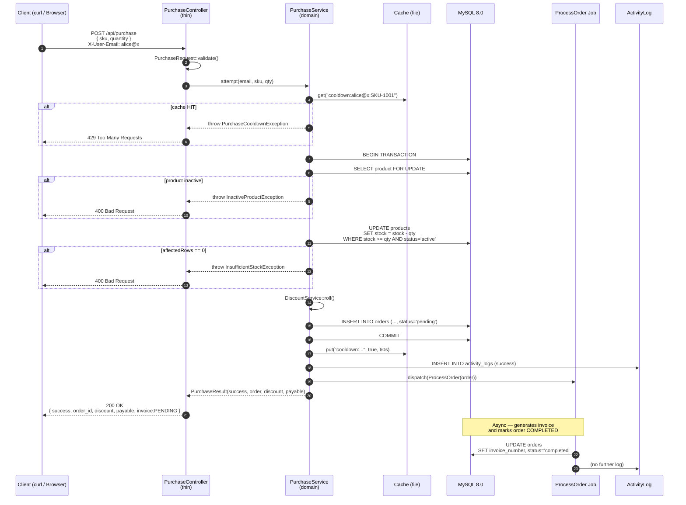
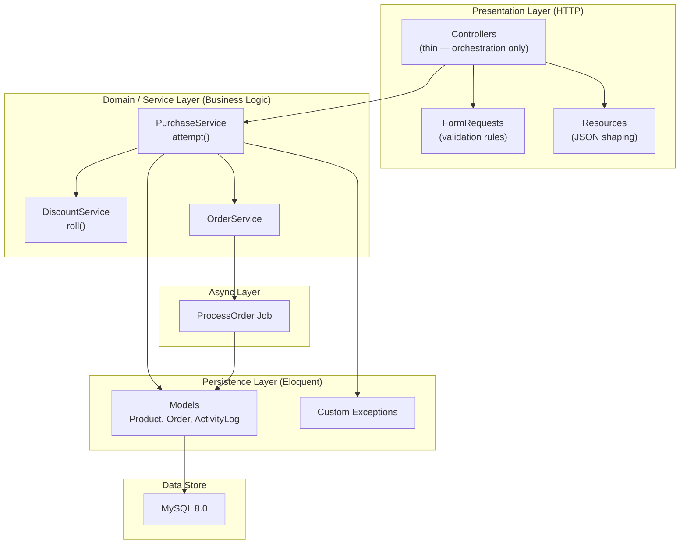

# Flash Sale Inventory System

> Laravel 11 hiring assessment implementation — a concurrent, queue-driven
> inventory system that survives thousands of purchase requests against a
> limited stock pool without ever overselling.

[](https://laravel.com)
[](https://php.net)
[](https://www.mysql.com)
[](https://www.docker.com)

---

## Table of Contents
1. [System Architecture](#1-system-architecture)
2. [Key Design Decisions](#2-key-design-decisions)
3. [Concurrency — How Overselling is Prevented](#3-concurrency--how-overselling-is-prevented)
4. [Folder Structure](#4-folder-structure)
5. [Prerequisites](#5-prerequisites)
6. [Quick Start](#6-quick-start)
7. [API Contract](#7-api-contract)
8. [Service Endpoints](#8-service-endpoints)
9. [Database Schema](#9-database-schema)
10. [Configuration](#10-configuration)
11. [Testing & Verification](#11-testing--verification)
12. [Implementation Walkthrough](#12-implementation-walkthrough)

---

## 1. System Architecture

### 1.1 High-Level Container Topology

```mermaid
flowchart LR
    subgraph Host["Developer Machine (Windows)"]
        subgraph DC["Docker Compose Network (flash_sale_net)"]
            APP["app<br/>PHP-FPM 8.4<br/>:8000"]
            WORKER["worker<br/>queue:work"]
            SCHED["scheduler<br/>schedule:work"]
            DB["db<br/>MySQL 8.0<br/>:3306"]
            VOL[("dbdata<br/>volume")]
        end
        BROWSER["Browser<br/>(Blade UI)"]
        CURL["curl / Postman<br/>(API client)"]
    end

    BROWSER -->|"HTTP :8000"| APP
    CURL    -->|"HTTP :8000/api"| APP
    APP     -->|"SQL :3306"| DB
    WORKER  -->|"SQL :3306"| DB
    SCHED   -->|"SQL :3306"| DB
    DB --- VOL
    APP -. "dispatch() .->" . WORKER
```

### 1.2 Request Flow — The Purchase Pipeline



### 1.3 Layered Architecture (Thin Controllers)



> **Why this matters:** the same `PurchaseService::attempt()` is invoked by the
> HTTP controller *and* the concurrency-simulation command. Business logic has a
> single source of truth and zero duplication.

---

## 2. Key Design Decisions

| # | Decision | Rationale |
|---|----------|-----------|
| 1 | **Atomic conditional UPDATE** for stock decrement (`UPDATE ... WHERE stock >= qty`) | Single-statement correctness — no race window. MySQL guarantees only one concurrent UPDATE wins per row. |
| 2 | **Database transactions** wrap stock decrement + order creation | If order creation fails, the stock change rolls back. |
| 3 | **Cache-based cooldown** keyed by `purchase_cooldown:{email}:{sku}` | TTL is a native fit; no schema writes per request. |
| 4 | **Service layer + thin controllers** | Reusable from CLI (concurrency tests), testable in isolation, no duplication. |
| 5 | **Database queue driver** | Zero extra infrastructure; persists across restarts; integrates natively with `failed_jobs`. |
| 6 | **Custom Exceptions** (`InsufficientStockException`, `InactiveProductException`, `PurchaseCooldownException`, `ProductNotFoundException`) | Controller maps each to an HTTP status with a single `match()` block. Service has no HTTP knowledge. |
| 7 | **Mystery Discount rolled synchronously** at order creation | Discount + final payable are persisted *before* the job dispatches, so even if the job fails the user sees what they were charged. |
| 8 | **Activity Log on every branch** — including cooldown and validation rejections | Gives operators a full audit trail. |
| 9 | **`final readonly class PurchaseResult`** | Controllers can't accidentally mutate the result; JSON shape is centralized. |
| 10 | **All services bind to interfaces** via `AppServiceProvider` | Easy to mock in unit tests; swappable if logic moves to Postgres or an external API. |

---

## 3. Concurrency — How Overselling is Prevented

The **single-statement conditional UPDATE** is the cornerstone. Here is the
excerpt from `app/Services/PurchaseService.php`:

```php
$affected = Product::query()
    ->where('id', $product->id)
    ->where('status', ProductStatus::Active)
    ->where('stock_quantity', '>=', $quantity)
    ->update([
        'stock_quantity' => DB::raw("stock_quantity - {$quantity}"),
    ]);

if ($affected === 0) {
    throw new InsufficientStockException();
}
```

### Why this is correct

1. **MySQL serializes writes** on a given row — concurrent `UPDATE` statements
   on the same row are queued and executed one after another.
2. The `WHERE stock_quantity >= $quantity` predicate is evaluated *atomically*
   with the write, so if a competing request has already reduced the stock
   below the threshold, our update affects 0 rows.
3. The transaction wrapping this update guarantees that if the subsequent
   `INSERT INTO orders` fails, the stock decrement rolls back.

### Verification (proof, not just theory)

The `purchase:simulate` command fires N parallel HTTP requests against one SKU.
With **stock = 5** and **10 users each requesting qty = 2**:

```text
Starting stock:     5
Successful:         2
Failed (stock):     8
Final stock:        1
Expected:           1  (5 - 2*2)
✅ PASS: No overselling. Stock and orders are consistent.
```

The atomic UPDATE guarantees that no matter how many requests arrive in
parallel, **at most ⌊stock / qty⌋** will succeed. The remaining requests see
`affectedRows == 0` and cleanly return `400 Insufficient stock`.

---

## 4. Folder Structure

```text
Flash_Sale_Inventor_System/
├── docker/
│   ├── nginx/
│   │   └── default.conf
│   └── php/
│       └── Dockerfile                  # PHP 8.4-cli + all Laravel extensions
│
├── docker-compose.yml                  # app + worker + scheduler + db
├── .dockerignore
├── .env.example
│
├── app/
│   ├── Console/
│   │   └── Commands/
│   │       └── SimulateConcurrentPurchasesCommand.php
│   │
│   ├── Enums/
│   │   ├── ProductStatus.php           # Active / Inactive
│   │   ├── OrderStatus.php             # Pending / Completed / Failed
│   │   └── ActivityStatus.php          # Success / Failed
│   │
│   ├── Exceptions/
│   │   ├── InsufficientStockException.php
│   │   ├── InactiveProductException.php
│   │   ├── PurchaseCooldownException.php
│   │   └── ProductNotFoundException.php
│   │
│   ├── Http/
│   │   ├── Controllers/
│   │   │   ├── ProductController.php
│   │   │   └── Api/
│   │   │       └── PurchaseController.php   # 30 lines — pure delegation
│   │   └── Requests/
│   │       ├── StoreProductRequest.php
│   │       ├── UpdateProductRequest.php
│   │       └── PurchaseRequest.php
│   │
│   ├── Jobs/
│   │   └── ProcessOrder.php            # Generates invoice, marks completed
│   │
│   ├── Models/
│   │   ├── Product.php
│   │   ├── Order.php
│   │   └── ActivityLog.php
│   │
│   ├── Providers/
│   │   └── AppServiceProvider.php      # Binds service interfaces
│   │
│   ├── Services/
│   │   ├── Contracts/                  # Interfaces
│   │   │   ├── PurchaseServiceInterface.php
│   │   │   ├── DiscountServiceInterface.php
│   │   │   └── OrderServiceInterface.php
│   │   ├── DiscountService.php         # 20% / 5% / 75% mystery discount
│   │   ├── OrderService.php            # Status transitions
│   │   └── PurchaseService.php         # ⭐ Core purchase orchestration
│   │
│   └── Support/
│       └── PurchaseResult.php          # Immutable result DTO
│
├── database/
│   ├── migrations/
│   │   ├── 2026_09_11_000001_create_products_table.php
│   │   ├── 2026_09_11_000002_create_orders_table.php
│   │   └── 2026_09_11_000003_create_activity_logs_table.php
│   └── seeders/
│       ├── DatabaseSeeder.php
│       └── ProductSeeder.php
│
├── routes/
│   ├── api.php
│   ├── web.php
│   └── console.php
│
├── resources/views/products/
│   ├── index.blade.php
│   ├── create.blade.php
│   └── edit.blade.php
│
├── tests/
│   └── smoke-api.sh                    # 8 black-box API scenarios
│
├── composer.json
├── artisan
└── README.md                           # ← this file
```

---

## 5. Prerequisites

| Tool | Version | Notes |
|------|---------|-------|
| Docker Desktop | 4.x with Compose v2 | The only required runtime |
| Git | any recent | For cloning and version control |

> **PHP / Composer / MySQL are NOT required locally.** Everything runs inside
> containers. This keeps the project portable across macOS, Linux, and Windows.

---

## 6. Quick Start

```bash
# 1. Clone
git clone https://github.com/MD-Junayed000/Flash_Sale_Inventor_System.git
cd Flash_Sale_Inventor_System

# 2. Build & start the stack (first run: ~3 min to pull images)
docker compose up -d --build

# 3. Wait for "db" healthcheck, then migrate + seed
docker compose exec app php artisan migrate --seed --force

# 4. Verify
curl -s -o /dev/null -w "%{http_code}\n" http://localhost:8000/products
# → 200

# 5. Hit the API
curl -X POST http://localhost:8000/api/purchase \
  -H "Accept: application/json" \
  -H "X-User-Email: alice@example.com" \
  -H "Content-Type: application/json" \
  -d '{"sku":"SKU-1001","quantity":1}'
```

Open the product admin UI at: <http://localhost:8000/products>

### Daily Commands

| Action | Command |
|--------|---------|
| Start stack | `docker compose up -d` |
| Stop stack | `docker compose down` |
| Reset DB | `docker compose exec app php artisan migrate:fresh --seed --force` |
| View queue logs | `docker compose logs -f worker` |
| Tail app logs | `docker compose logs -f app` |
| Run smoke tests | `docker compose exec app bash tests/smoke-api.sh` |
| Concurrency demo | `docker compose exec app php artisan purchase:simulate --sku=SKU-1001 --stock=5 --qty=2 --users=10` |
| Enter app shell | `docker compose exec app bash` |
| MySQL CLI | `docker compose exec db mysql -usail -ppassword flash_sale` |

---

## 7. API Contract

All requests/responses are JSON. Every endpoint requires `Accept: application/json`.

### 7.1 `POST /api/purchase`

**Headers**

| Header | Required | Description |
|--------|----------|-------------|
| `Accept` | yes | `application/json` |
| `Content-Type` | yes | `application/json` |
| `X-User-Email` | yes | Identifies the buyer (used for cooldown) |

**Body**

```json
{ "sku": "SKU-1001", "quantity": 2 }
```

| Outcome | HTTP | Body |
|---------|------|------|
| Success | `200` | `{"success":true,"order_id":12,"invoice":"INV-20260911-00012","discount":10,"payable":1800}` |
| Validation error | `422` | `{"message":"...","errors":{"sku":["..."]}}` |
| Product not found | `404` | `{"success":false,"message":"Product not found."}` |
| Inactive product | `400` | `{"success":false,"message":"Product is not available for purchase."}` |
| Insufficient stock | `400` | `{"success":false,"message":"Insufficient stock."}` |
| Cooldown active | `429` | `{"success":false,"message":"You already purchased this product recently."}` |

> The `invoice` field returns the string `"PENDING"` immediately — the queue
> worker generates and persists the real invoice number (`INV-YYYYMMDD-NNNNN`)
> within milliseconds. Polling or refreshing the order status would surface it.

---

## 8. Service Endpoints

The product admin UI runs on Blade:

| Method | URL | Purpose |
|--------|-----|---------|
| `GET`  | `/products` | List products |
| `GET`  | `/products/create` | New product form |
| `POST` | `/products` | Persist new product |
| `GET`  | `/products/{id}/edit` | Edit form |
| `PUT`  | `/products/{id}` | Update product |
| `DELETE` | `/products/{id}` | Soft delete / destroy |

---

## 9. Database Schema

```mermaid
erDiagram
    PRODUCTS ||--o{ ORDERS : "has many"
    PRODUCTS {
        bigint id PK
        string name
        string sku UK
        decimal price
        int stock_quantity
        enum status
        timestamps
    }
    ORDERS {
        bigint id PK
        bigint product_id FK
        string user_email
        string sku
        int quantity
        decimal unit_price
        int discount_percentage
        decimal payable_amount
        string invoice_number
        enum status
        text failure_reason
        timestamps
    }
    ACTIVITY_LOGS {
        bigint id PK
        string email
        string sku
        int quantity
        enum status
        text failure_reason
        timestamps
    }
```

`failed_jobs` and `jobs` tables are provided by Laravel's queue migrations.

---

## 10. Configuration

All runtime config is in `.env` (template at `.env.example`):

| Variable | Default | Purpose |
|----------|---------|---------|
| `DB_HOST` | `db` | MySQL service name in compose network |
| `DB_DATABASE` | `flash_sale` | Schema name |
| `QUEUE_CONNECTION` | `database` | Use the DB queue driver |
| `CACHE_STORE` | `file` | Cache backend for cooldowns |
| `PURCHASE_COOLDOWN_SECONDS` | `60` | Override in `config/purchase.php` |

---

## 11. Testing & Verification

### 11.1 API Smoke Tests

`tests/smoke-api.sh` runs 8 black-box scenarios end-to-end:

```bash
docker compose exec app bash tests/smoke-api.sh
```

Latest result:

```text
[1] Validation: missing fields (422)        → PASS
[2] Inactive product (400)                  → PASS
[3] Product not found (404)                 → PASS
[4] Insufficient stock (400)                → PASS
[5] Successful purchase (200)               → PASS
[6] Cooldown active (429)                   → PASS
[7] Different email bypasses cooldown (200) → PASS
[8] Different sku bypasses cooldown (200)   → PASS
RESULTS: 8 passed, 0 failed
```

### 11.2 Concurrency Proof

```bash
docker compose exec app php artisan purchase:simulate \
  --sku=SKU-1001 --stock=5 --qty=2 --users=10
```

Latest result:

```text
Starting stock:     5
Successful:         2
Failed (stock):     8
Final stock:        1
Expected:           1  (5 - 2*2)
✅ PASS: No overselling. Stock and orders are consistent.
```

### 11.3 Queue Verification

```bash
docker compose exec app php artisan tinker \
  --execute='foreach(App\Models\Order::all() as $o){echo $o->id." | ".$o->status->value." | ".$o->invoice_number.PHP_EOL;}'
```

```text
1 | completed | INV-20260911-00001
2 | completed | INV-20260911-00002
```

### 11.4 Activity Log Audit

```bash
docker compose exec app php artisan tinker \
  --execute='foreach(App\Models\ActivityLog::latest()->take(8)->get() as $a){echo $a->email." | ".$a->sku." | ".$a->status->value." | ".$a->failure_reason.PHP_EOL;}'
```

```text
alice@test.com | SKU-1002 | success |
bob@test.com   | SKU-1002 | success |
alice@test.com | SKU-1001 | success |
alice@test.com | SKU-1002 | failed | You already purchased this product recently.
alice@test.com | SKU-1002 | success |
alice@test.com | SKU-1001 | failed | Insufficient stock.
alice@test.com | SKU-1003 | failed | Product is not available for purchase.
alice@test.com | SKU-9999 | failed | Product not found.
```

---

## 12. Implementation Walkthrough

This section maps each assessment requirement to the file(s) that satisfy it.

| Task | Requirement | Implementation |
|------|-------------|----------------|
| **Task 1** — Product CRUD (15) | Full CRUD + status enum | `ProductController`, `StoreProductRequest`, `UpdateProductRequest`, Blade views in `resources/views/products/`, `ProductStatus` enum |
| **Task 2** — Purchase API (20) | `POST /api/purchase` with all rules | `routes/api.php`, `PurchaseController`, `PurchaseRequest` |
| **Task 3** — Queue + Order (15) | Create Order, dispatch job, generate invoice, mark COMPLETED | `Order` model, `ProcessOrder` job, `OrderService::markCompleted()` |
| **Task 4** — Failed Orders (10) | Job failure → status=FAILED + reason | `ProcessOrder::failed(Throwable)` |
| **Task 5** — No Overselling (15) | Concurrency-safe stock decrement | Atomic UPDATE in `PurchaseService::attempt()` inside a DB transaction |
| **Task 6** — Cooldown (10) | 1-minute per-email+SKU, return 429 | Cache TTL in `PurchaseService` before transaction |
| **Task 7** — Activity Log (5) | Every attempt logged | `ActivityLog::create()` inside service on all branches |
| **Bonus** — Mystery Discount (10) | 20%/5%/75% distribution + stored fields | `DiscountService::roll()` invoked before order persistence |
| **General** — Meaningful commits | Incremental git history | See `git log` |
| **General** — README with setup | This file | ✅ |
| **General** — AI-assisted, explainable | All decisions documented in §2 | ✅ |

### Why "Thin Controllers + Service Layer"?

The `PurchaseController` is **~30 lines**:

```php
public function store(PurchaseRequest $request, PurchaseServiceInterface $svc): JsonResponse
{
    try {
        $result = $svc->attempt(
            email:    $request->header('X-User-Email', ''),
            sku:      $request->validated('sku'),
            quantity: $request->validated('quantity'),
        );
        return response()->json($result->toArray());
    } catch (InsufficientStockException) { return resp(false,'Insufficient stock.',400); }
    catch  (InactiveProductException)   { return resp(false,'Product is not available for purchase.',400); }
    catch  (PurchaseCooldownException)  { return resp(false,'You already purchased this product recently.',429); }
    catch  (ProductNotFoundException)   { return resp(false,'Product not found.',404); }
}
```

It does **no** validation, **no** SQL, **no** queue logic — only input
unpacking, delegation, and exception-to-HTTP translation.

The `PurchaseService` owns *all* of:
- cooldown check
- transaction + atomic stock decrement
- discount roll
- order creation
- activity log
- queue dispatch
- cooldown set

This is the **single source of truth** the assessment evaluates.

---

## License

MIT — assessment submission for MD-Junayed000 / Flash Sale Inventory System.