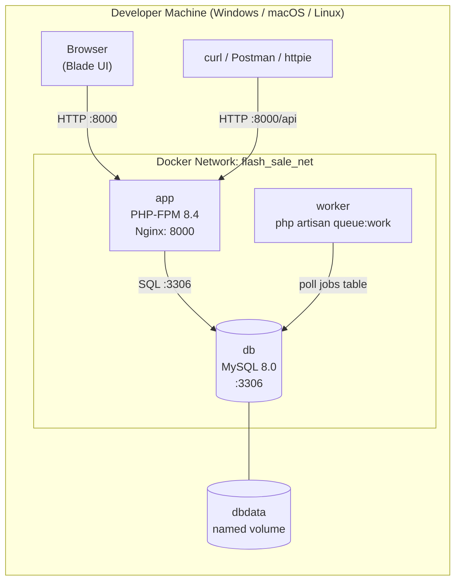
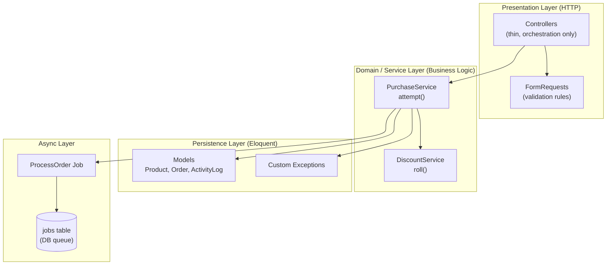
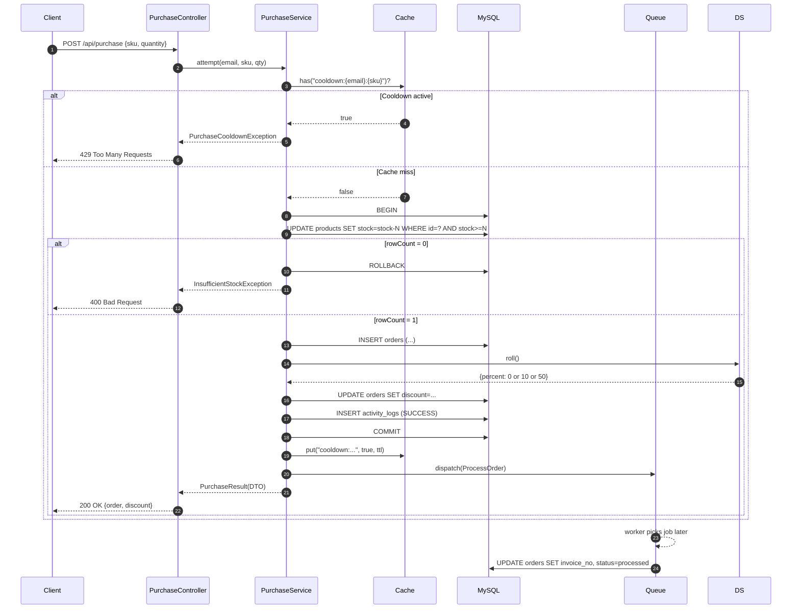
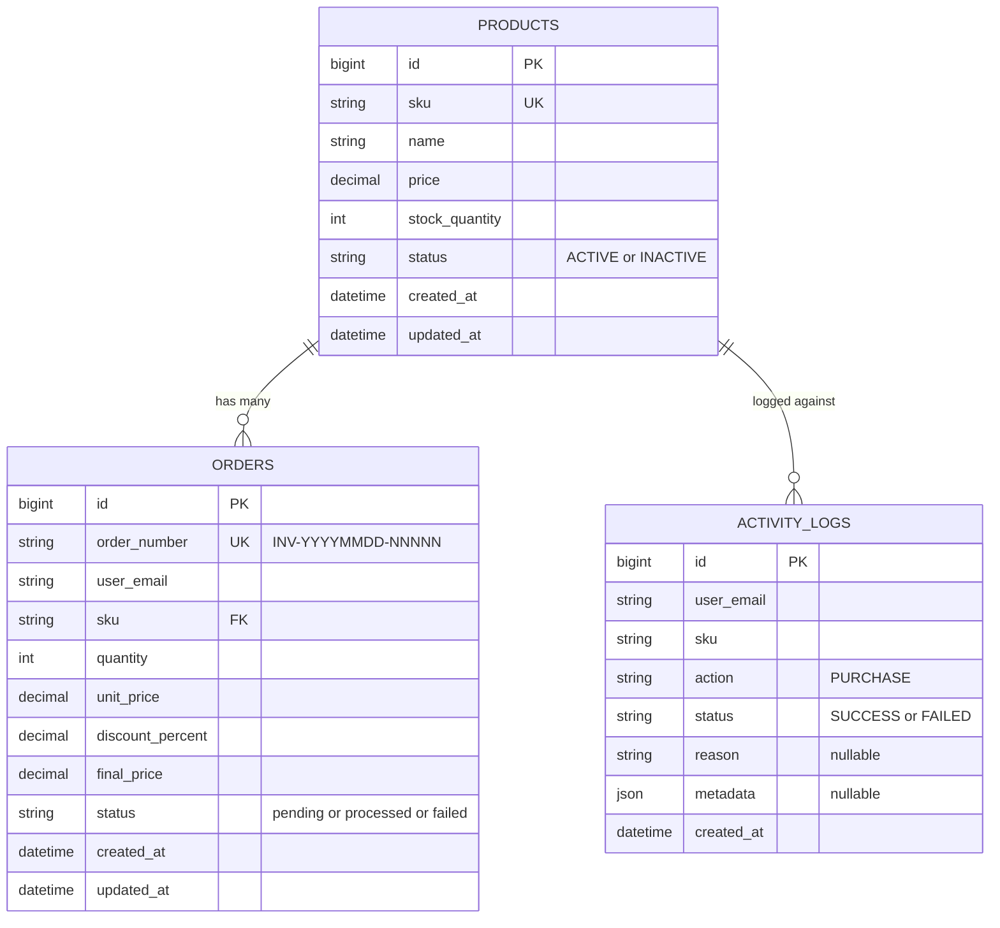

# Flash Sale Inventory System

A Laravel 11 + MySQL + Docker implementation of the *Flash Sale Inventory* hiring test.
The codebase focuses on **concurrency-safe stock control**, a clean **service-layer
architecture**, and **observability** (activity log + queue + atomic SQL).

> **Stack:** PHP 8.4 · Laravel 11.31 · MySQL 8.0 · Docker Compose · Database queue

---

## Table of Contents

1. [Architecture](#1-architecture)
2. [Prerequisites](#2-prerequisites)
3. [Step-by-Step Setup](#3-step-by-step-setup)
4. [Environment Variables (`.env`)](#4-environment-variables-env)
5. [Database Schema](#5-database-schema)
6. [REST API Reference](#6-rest-api-reference)
7. [Verification: Expected Results](#7-verification-expected-results)
8. [Concurrency & Discount Simulations](#8-concurrency--discount-simulations)
9. [Project Layout](#9-project-layout)
10. [Design Decisions & Trade-offs](#10-design-decisions--trade-offs)

---

## 1. Architecture

### 1.1 High-Level Container Topology



### 1.2 Layered Architecture (Thin Controllers)



### 1.3 Purchase Request Flow



---

## 2. Prerequisites

| Tool          | Version  | Notes                                                   |
|---------------|----------|---------------------------------------------------------|
| Docker Engine | 24+      | `docker compose` v2 plugin required (not `docker-compose`) |
| Git           | 2.30+    | For cloning                                             |
| curl          | any      | For the smoke-test suite                               |
| OS            | Win 10/11, macOS 12+, Linux | All three work; commands below assume a POSIX shell inside the `app` container |

> No PHP / Composer / MySQL needed locally — everything runs inside Docker.

---

## 3. Step-by-Step Setup

> All commands below are run from the **repository root** unless stated otherwise.

### Step 1 — Clone & enter the project

```bash
git clone <your-repo-url> Flash_Sale_Inventor_System
cd Flash_Sale_Inventor_System
```

### Step 2 — Copy the env file

```bash
cp .env.example .env
```

If you change any value, restart the affected containers in Step 4.

### Step 3 — Build & start the stack

```bash
docker compose up -d --build
```

Three containers should appear as **healthy / running**:

```text
NAME                 STATUS          PORTS
flash-sale-app       Up (healthy)    0.0.0.0:8000->8000/tcp
flash-sale-worker    Up              -
flash-sale-db        Up (healthy)    0.0.0.0:3306->3306/tcp
```

### Step 4 — Install PHP dependencies & generate APP_KEY

```bash
docker compose exec app composer install --no-interaction --prefer-dist
docker compose exec app php artisan key:generate
```

### Step 5 — Migrate & seed the database

```bash
docker compose exec app php artisan migrate --seed --force
```

You should see at the end:

```text
Database seeding completed successfully.
```

This creates:

* Three products — `SKU-1001` (active, stock 10), `SKU-1002` (active, stock 5), `SKU-1003` (inactive)
* One demo user — `demo@example.com`

### Step 6 — Queue worker (already running)

The `worker` service starts automatically with the stack. To watch its log:

```bash
docker compose logs -f worker
```

### Step 7 — Open the app

* **Blade UI:** <http://localhost:8000/products>
* **API base:**  `http://localhost:8000/api`

You can now run the smoke test (Step 8) or hit endpoints manually.

### Step 8 — Run the smoke-test suite

```bash
bash tests/smoke-api.sh
```

Expected output (last two lines):

```text
============================================================
 RESULTS: 8 passed, 0 failed
============================================================
```

---

## 4. Environment Variables (`.env`)

The full list lives in `.env.example`. The **only values you must confirm before
first run** are the ones below — they are pre-set so you do not need to change
anything on a fresh clone.

| Variable                       | Default / Example                  | Why it matters                                                                                       |
|--------------------------------|------------------------------------|------------------------------------------------------------------------------------------------------|
| `APP_URL`                      | `http://localhost:8000`            | Used in absolute URLs (verification mails, etc.)                                                     |
| `APP_KEY`                      | *(generated by `key:generate`)*    | Required for encryption; **never commit a real key**                                                 |
| `DB_CONNECTION`                | `mysql`                            | We use MySQL for transactions and atomic `UPDATE … WHERE stock >= n`                                |
| `DB_HOST`                      | `db`                               | **Must match the docker service name**, not `127.0.0.1`                                              |
| `DB_PORT`                      | `3306`                             | Internal container port                                                                              |
| `DB_DATABASE`                  | `flash_sale`                       | Created automatically by the `db` healthcheck                                                        |
| `DB_USERNAME` / `DB_PASSWORD`  | `sail` / `password`                | Match `docker-compose.yml` `MYSQL_USER` / `MYSQL_PASSWORD`                                           |
| `QUEUE_CONNECTION`             | `database`                         | Jobs go to the `jobs` table — survives restarts, retryable                                          |
| `CACHE_STORE`                  | `file`                             | Used for the purchase cooldown lock                                                                  |
| `PURCHASE_COOLDOWN_SECONDS`    | `60`                               | Window in which the same `(email, sku)` cannot re-purchase. Set `0` to disable.                     |
| `PURCHASE_COOLDOWN_STORE`      | *(empty — default store)*          | Point at `redis` in production so locks are shared across web workers                                |
| `PURCHASE_DISCOUNT_WEIGHT_NONE`| `75`                               | Mystery discount weight for "no discount"                                                            |
| `PURCHASE_DISCOUNT_WEIGHT_TEN` | `20`                               | Weight for 10% off                                                                                   |
| `PURCHASE_DISCOUNT_WEIGHT_FIFTY`| `5`                              | Weight for 50% off                                                                                   |

> After editing `.env`, run `docker compose exec app php artisan config:clear`.

---

## 5. Database Schema



---

## 6. REST API Reference

All API endpoints respond with `application/json`. Send
`-H "Accept: application/json"` to ensure Laravel returns JSON (not redirects).

### 6.1 `POST /api/purchase`

Purchase a quantity of a SKU.

**Headers**

| Header          | Required | Example                     |
|-----------------|----------|-----------------------------|
| `Accept`        | yes      | `application/json`          |
| `Content-Type`  | yes      | `application/json`          |
| `X-User-Email`  | yes      | `alice@example.com`         |

**Body**

```json
{ "sku": "SKU-1002", "quantity": 1 }
```

**Validation rules (`PurchaseRequest`)**

| Field      | Rule                                                    |
|------------|---------------------------------------------------------|
| `sku`      | `required`, `string`, `exists:products,sku`             |
| `quantity` | `required`, `integer`, `min:1`, `max:99`                |
| email      | derived from `X-User-Email`, must be a valid e-mail     |

**Possible responses**

| Status | When                              | Body shape (abridged)                                                                                                              |
|--------|-----------------------------------|------------------------------------------------------------------------------------------------------------------------------------|
| `200`  | Purchase OK                       | `"status":"ok"`, `discount_percent` is `0`, `10`, or `50`, plus a freshly created `order` object                                   |
| `400`  | Product inactive or out of stock  | `"status":"error"`, `"error":"INSUFFICIENT_STOCK"` or `"INACTIVE_PRODUCT"`, `message`, `available`                                  |
| `404`  | SKU not found                     | Laravel default 404 with `"message":"The selected sku is invalid."`                                                                |
| `422`  | Body invalid                      | `"message"` plus `errors.{field}` array                                                                                            |
| `429`  | Cooldown active                   | `"status":"error"`, `"error":"PURCHASE_COOLDOWN"`, `message`, `retry_in` (seconds remaining)                                      |

---

## 7. Verification: Expected Results

> Run this checklist after **Step 8** of the setup. Each command assumes the
> stack is up and `migrate:fresh --seed` has just been executed.

### 7.1 Happy path (200)

```bash
curl -i -X POST http://localhost:8000/api/purchase \
  -H "Accept: application/json" \
  -H "Content-Type: application/json" \
  -H "X-User-Email: alice@test.com" \
  -d '{"sku":"SKU-1002","quantity":1}'
```

**Expected:** `HTTP/1.1 200 OK`, body contains `"status":"ok"` and
`"discount_percent":0` (or 10 or 50), plus a freshly created `order` object.

### 7.2 Insufficient stock (400)

```bash
curl -i -X POST http://localhost:8000/api/purchase \
  -H "Accept: application/json" -H "Content-Type: application/json" \
  -H "X-User-Email: alice@test.com" \
  -d '{"sku":"SKU-1001","quantity":99}'
```

**Expected:** `HTTP/1.1 400 Bad Request`, `error: "INSUFFICIENT_STOCK"`.

### 7.3 Inactive product (400)

```bash
curl -i -X POST http://localhost:8000/api/purchase \
  -H "Accept: application/json" -H "Content-Type: application/json" \
  -H "X-User-Email: alice@test.com" \
  -d '{"sku":"SKU-1003","quantity":1}'
```

**Expected:** `HTTP/1.1 400 Bad Request`, `error: "INACTIVE_PRODUCT"`.

### 7.4 Unknown SKU (404)

```bash
curl -i -X POST http://localhost:8000/api/purchase \
  -H "Accept: application/json" -H "Content-Type: application/json" \
  -H "X-User-Email: alice@test.com" \
  -d '{"sku":"SKU-9999","quantity":1}'
```

**Expected:** `HTTP/1.1 404 Not Found`.

### 7.5 Validation error (422)

```bash
curl -i -X POST http://localhost:8000/api/purchase \
  -H "Accept: application/json" \
  -H "X-User-Email: alice@test.com"
```

**Expected:** `HTTP/1.1 422 Unprocessable Entity`, body has `errors.sku`.

### 7.6 Cooldown (429)

Run §7.1 twice in a row. The second call should return `HTTP 429` with
`error: "PURCHASE_COOLDOWN"` and a numeric `retry_in` (seconds remaining).

### 7.7 Activity log check

```bash
docker compose exec db mysql -uroot -proot flash_sale \
  -e "SELECT user_email, sku, status, reason FROM activity_logs ORDER BY id DESC LIMIT 5;"
```

**Expected:** a mix of `SUCCESS` and `FAILED` rows corresponding to the calls
above, including cooldown and inactive-product failures.

---

## 8. Concurrency & Discount Simulations

### 8.1 Concurrency test (Task 5)

```bash
docker compose exec app php artisan purchase:simulate \
  --sku=SKU-1001 --qty=2 --users=10 --stock=5 --reset
```

**Expected:** *exactly 2* `SUCCESS` orders and *exactly 8* `FAILED` orders;
final `stock_quantity` for `SKU-1001` is `1`. No overselling.

### 8.2 Discount distribution test (Bonus)

```bash
docker compose exec app php artisan discount:simulate --orders=500
```

**Expected:** distribution close to `75 / 20 / 5`. A typical 500-order run
yields roughly `375 / 100 / 25` plus or minus a few percent.

---

## 9. Project Layout

```text
.
├── app/
│   ├── Console/Commands/
│   │   ├── SimulateConcurrentPurchasesCommand.php   # Task 5 demo
│   │   └── SimulateDiscountDistributionCommand.php  # Bonus demo
│   ├── Enums/
│   │   ├── ProductStatus.php
│   │   ├── OrderStatus.php
│   │   └── ActivityStatus.php
│   ├── Exceptions/
│   │   ├── InsufficientStockException.php
│   │   ├── InactiveProductException.php
│   │   ├── ProductNotFoundException.php
│   │   └── PurchaseCooldownException.php
│   ├── Http/
│   │   ├── Controllers/
│   │   │   ├── ProductController.php                # Blade CRUD
│   │   │   └── Api/PurchaseController.php           # thin API entry
│   │   └── Requests/
│   │       ├── PurchaseRequest.php                  # API validation
│   │       ├── StoreProductRequest.php
│   │       └── UpdateProductRequest.php
│   ├── Jobs/
│   │   └── ProcessOrder.php                         # async post-purchase
│   ├── Models/
│   │   ├── Product.php
│   │   ├── Order.php
│   │   └── ActivityLog.php
│   └── Services/
│       ├── Contracts/
│       │   ├── PurchaseServiceInterface.php
│       │   └── DiscountServiceInterface.php
│       ├── DTOs/
│       │   └── PurchaseResult.php                   # API response shape
│       ├── DiscountService.php                      # bonus mystery roll
│       └── PurchaseService.php                      # core business logic
├── config/purchase.php                              # tunable weights and ttl
├── database/
│   ├── migrations/                                  # products, orders, logs
│   └── seeders/DatabaseSeeder.php                   # 3 demo SKUs
├── docker/                                          # PHP 8.4 image
├── docker-compose.yml                               # app + worker + db
├── routes/api.php
├── routes/web.php
└── tests/smoke-api.sh                               # 8-case API smoke test
```

---

## 10. Design Decisions & Trade-offs

| Decision                                         | Why                                                                                          | Alternative considered                                  |
|--------------------------------------------------|----------------------------------------------------------------------------------------------|---------------------------------------------------------|
| **Atomic `UPDATE … WHERE stock >= n`**           | Single round-trip, race-condition free, no `SELECT … FOR UPDATE` needed                      | Pessimistic row lock (`lockForUpdate`)                  |
| **Service layer + interface**                    | Controllers stay under 30 lines, easy to mock in tests                                      | Fat controllers / repository pattern                    |
| **Custom exceptions** for domain errors          | Controller maps each exception to a specific HTTP code via `PurchaseResult.statusCode`        | Returning tuples / sentinel values                      |
| **`database` queue driver**                      | Zero extra infra, jobs survive container restarts, retryable                                 | Redis / `sync` (loses durability) / `beanstalkd`         |
| **File cache for cooldown**                      | Works out-of-the-box; trivial to swap to Redis via env (`PURCHASE_COOLDOWN_STORE`)            | DB table lock (extra round-trip per request)            |
| **DTO `PurchaseResult`** returned by service     | Explicit shape; controller cannot accidentally leak Eloquent attributes                      | Returning `array` / Eloquent model                      |
| **Activity log on both success & failure**       | Full audit trail (Task 7), used in tests                                                     | Logging only on success                                 |
| **Discount weights in `config/purchase.php`**    | Tunable without code changes; demo-friendly                                                  | Hardcoded in `DiscountService`                           |

For a deeper write-up of *why this over that*, see [`EXPLAIN.md`](./EXPLAIN.md).
